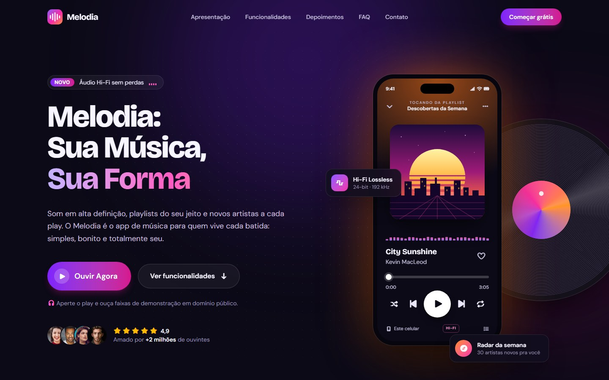

<div align="center">


# Melodia · Landing Page

**Sua Música, Sua Forma.**
Landing page do app de músicas **Melodia**, desenvolvida para o **Check-Point 05** da disciplina
**Front-end Design** (Engenharia de Software), com o Prof. Lucas Sousa.


**Acesse o site:** https://novaessftw.github.io/melodia_landing-page/
<sub>Repositório: https://github.com/NovaesSftw/melodia_landing-page</sub>


&nbsp;


</div>

---

## Sumário

- [Sobre a aplicação](#sobre-a-aplicação)
- [Requisitos do Check-Point e onde foram atendidos](#requisitos-do-check-point-e-onde-foram-atendidos)
- [Tecnologias utilizadas](#tecnologias-utilizadas)
- [Identidade visual](#identidade-visual)
- [Organização dos arquivos](#organização-dos-arquivos)
- [Interações em JavaScript](#interações-em-javascript)
- [Como executar localmente](#como-executar-localmente)
- [Deploy no GitHub Pages](#deploy-no-github-pages)
- [Formulário: coletando e-mails de verdade](#formulário-coletando-e-mails-de-verdade)
- [Testes realizados](#testes-realizados)
- [Créditos](#créditos)
- [Integrantes do grupo](#integrantes-do-grupo)

---

## Sobre a aplicação

O **Melodia** é um app de música (fictício) pensado para quem vive cada batida. Esta landing page apresenta o
app, mostra seus diferenciais e capta e-mails de interessados para futuras campanhas de marketing.

| | |
|---|---|
| **Objetivo** | Desenvolver a landing page do app de músicas Melodia. |
| **Público-alvo** | Amantes de música, jovens e pessoas que buscam novas descobertas musicais. |
| **Estilo visual** | Moderno e clean, com cores vibrantes e elementos musicais (equalizador, disco de vinil, ondas sonoras). |
| **Diferenciais** | Qualidade de som superior · Criação de playlists personalizadas · Descoberta de novos artistas · Interface intuitiva. |

**Destaque:** a "imagem em destaque" do hero é um **mockup interativo** do app, feito com HTML + Tailwind.
O botão **Ouvir Agora** toca músicas de verdade (domínio público), e o **equalizador** da seção
Funcionalidades altera o som em tempo real com a Web Audio API.

---

## Requisitos do Check-Point e onde foram atendidos

| Requisito (slides) | Como foi atendido | Onde |
|---|---|---|
| **Hero:** título "Melodia: Sua Música, Sua Forma" | `<h1>` com o texto exato, "Sua Forma" em gradiente | `index.html` → `#inicio` |
| **Hero:** breve descrição | Parágrafo de apresentação + prova social (avaliação 4,9 e avatares) | `#inicio` |
| **Hero:** CTA "Ouvir Agora" | Botão que toca a música de demonstração; o texto muda para "Pausar música" | `#inicio` + `assets/js/player.js` |
| **Hero:** vídeo ou imagem em destaque do app | Mockup de celular interativo com player funcional, disco de vinil em CSS e cartões flutuantes | `#hero-player` |
| **Apresentação:** principais benefícios | 4 cards com os diferenciais do app + números animados | `#apresentacao` |
| **Apresentação:** ícones do Font Awesome | `fa-headphones`, `fa-list-ul`, `fa-compass`, `fa-hand-pointer` (são cerca de 60 ícones diferentes no site) | `#apresentacao` |
| **Apresentação:** estilo consistente com Tailwind | Componentes `.icon-badge`, `.card` e `.eyebrow` reutilizados em todas as seções | `src/input.css` (seção 4) |
| **Funcionalidades** em cards/seções separadas | 6 cards em layout "bento": Equalizador (interativo), Playlists, Radar, Letras, Offline e Dispositivos | `#funcionalidades` |
| **Depoimentos** com citações e fotos de perfil | 3 depoimentos com `<figure>`, `<blockquote>`, `<cite>`, foto, nome, cidade e estrelas | `#depoimentos` |
| **Formulário** para coletar e-mails | Nome, e-mail, estilo favorito e consentimento LGPD, com validação em JS | `#contato` + `assets/js/form.js` |
| **Formulário** responsivo com Tailwind | 1 coluna no celular e 2 colunas a partir de `sm:` | `#contato` |
| **Rodapé:** contato, redes sociais e política de privacidade | E-mail, telefone, cidade, horário, Instagram/TikTok/X/YouTube e página de privacidade | `<footer>` + `politica-de-privacidade.html` |
| **Menu fixo com efeito de transparência (JS)** | Header `fixed` transparente; ao rolar, o JS adiciona `data-scrolled` e o Tailwind aplica fundo translúcido + blur | `assets/js/main.js` (seção 1) |
| Paleta de cores e tipografia definidas | Tokens no `@theme` do Tailwind (ver [Identidade visual](#identidade-visual)) | `src/input.css` (seção 1) |
| Google Fonts | Bricolage Grotesque (títulos) + DM Sans (textos) | `<head>` |
| Responsividade | Mobile-first com `sm:`, `md:`, `lg:` e `xl:`; menu hambúrguer no celular | todas as seções |
| Áudios sem copyright | 4 faixas em domínio público do acervo FreePD | `assets/audio/` |
| Biblioteca JavaScript (opcional) | Optamos por APIs nativas do navegador (IntersectionObserver, Web Audio e Media Session), sem dependências | `assets/js/` |
| Publicação no GitHub Pages | Site estático pronto para deploy, sem etapa de build no servidor | ver [Deploy](#deploy-no-github-pages) |
| README | Este arquivo | `README.md` |

---

## Tecnologias utilizadas

- **HTML5**: estrutura semântica (`header`, `nav`, `main`, `section`, `article`, `figure`, `blockquote`,
  `details`/`summary`, `address`, `footer`), formulário com `novalidate` + validação própria, elemento `<audio>`
  e atributos de acessibilidade (`aria-*`, link "Pular para o conteúdo", textos alternativos).
- **CSS3**: variáveis CSS, gradientes (o disco de vinil é feito só com `repeating-radial-gradient` e
  `conic-gradient`), `@keyframes`, `backdrop-filter`, `@property` (cor animada do player), `color-mix()`,
  `accent-color`, `text-wrap: balance` e `prefers-reduced-motion`. Código em `src/input.css`.
- **Tailwind CSS v4**: tema próprio com `@theme`, classes utilitárias no HTML, prefixos responsivos,
  variantes `hover:`, `data-*:`, `aria-*:`, `has-*:`, `group-*:` e `open:`, a variante customizada
  `playing:` (criada com `@custom-variant`) e componentes com `@apply`. O CSS final é gerado pelo
  **Tailwind CLI** já minificado e contém só as classes usadas.
- **JavaScript** (puro, sem frameworks): menu fixo com transparência, menu mobile, scrollspy, animações
  com `IntersectionObserver`, contadores animados, player de áudio, equalizador e visualizador com a
  **Web Audio API**, controles de mídia do sistema com a **Media Session API** e formulário com
  **Fetch API** + `localStorage`.
- **Font Awesome 7** (via CDN cdnjs, com verificação de integridade SRI): ícones de todo o site.
- **Google Fonts**: Bricolage Grotesque e DM Sans.
- **GitHub Pages**: hospedagem e deploy.

---

## Identidade visual

| Função | Cor | Uso |
|---|---|---|
| Fundo (ink-900) | `#0C0A17` | Base escura: destaca as cores vibrantes |
| Cartões (ink-850/800) | `#110E1F` / `#181430` | Superfícies elevadas |
| Texto principal | `#F7F5FF` | Títulos |
| Texto de apoio | `#C5BFDC` | Parágrafos |
| Marca, magenta (brand-500/600) | `#F72BA8` / `#D6168E` | Botões, ícones e destaques |
| Apoio, violeta | `violet-600` do Tailwind | Gradientes e brilhos |
| Acento, laranja | `orange-300/400` do Tailwind | Final dos gradientes ("pôr do sol") |

- **Tipografia:** *Bricolage Grotesque* nos títulos (personalidade e ritmo) e *DM Sans* nos textos (leitura confortável).
- **Elemento musical recorrente:** barras de equalizador (logo, selo "Novo", status do player e visualizador), que "dançam" enquanto a música toca.
- **Contraste:** textos e botões seguem o nível AA do WCAG sobre o fundo escuro.

---

## Organização dos arquivos

```text
melodia-landing-page/
├── index.html                    # Landing page (todas as seções)
├── politica-de-privacidade.html  # Página de privacidade (link do rodapé)
├── assets/
│   ├── css/
│   │   └── style.css             # CSS final gerado pelo Tailwind CLI (não editar)
│   ├── js/
│   │   ├── main.js               # Menu fixo/transparente, menu mobile, scrollspy, animações, contadores
│   │   ├── player.js             # Player de áudio, equalizador, visualizador e mini player
│   │   └── form.js               # Validação e envio do formulário de e-mails
│   ├── audio/                    # Músicas em domínio público (FreePD)
│   └── img/
│       ├── covers/               # Capas dos álbuns (SVG autorais)
│       ├── favicon.svg
│       ├── apple-touch-icon.png
│       └── og-image.jpg          # Prévia ao compartilhar o link
├── src/
│   └── input.css                 # CSS fonte: Tailwind + tema + CSS3 customizado
├── docs/                         # Prints e roteiro de apresentação
├── package.json                  # Scripts do Tailwind (dev/build)
└── README.md
```

---

## Interações em JavaScript

**`main.js`**
1. **Menu fixo com transparência:** o `scroll` é "escutado" com `{ passive: true }` e processado uma vez por quadro com `requestAnimationFrame`. Passando de 24px, o header recebe `data-scrolled`.
2. **Menu mobile:** abre e fecha pelo botão (com `aria-expanded`) e fecha com Esc, ao clicar fora ou num link.
3. **Scrollspy:** um `IntersectionObserver` destaca no menu a seção visível (`aria-current="true"`).
4. **Animações de entrada:** elementos `.reveal` aparecem ao entrar na tela.
5. **Contadores:** os números sobem de 0 até o valor final, no formato brasileiro (`4,9`).

**`player.js`**
- Um único `<audio>` controla o celular do hero **e** o mini player flutuante, ligados por atributos `data-player-*`.
- **Web Audio API:** 10 filtros `BiquadFilterNode` formam o equalizador, e um `AnalyserNode` alimenta o visualizador.
- Aleatório, repetir, curtir, anterior/próxima, barra de progresso acessível pelo teclado e controles na central de mídia do sistema (Media Session API).
- Se um MP3 local falhar, a mesma faixa é buscada no Internet Archive; se falhar de novo, pula para a próxima.

**`form.js`**
- Mensagens de erro em português, ligadas aos campos por `aria-invalid` e `aria-describedby`.
- Honeypot anti-spam, estado "Enviando…" e aviso quando o e-mail já está cadastrado.

---

## Como executar localmente

**Só para ver o site:** abra o `index.html` no navegador. Para testar o equalizador de verdade, use um
servidor local (a Web Audio API não funciona com arquivos abertos direto do disco):

- no VS Code, instale a extensão **Live Server** e clique em *Go Live*; ou
- no terminal, dentro da pasta do projeto:

```bash
npx serve .
```

**Para editar os estilos** (é necessário ter o [Node.js](https://nodejs.org) instalado):

```bash
npm install
```

```bash
npm run dev
```

O `npm run dev` recompila o `assets/css/style.css` a cada alteração no HTML, no JS ou no `src/input.css`.
Antes de publicar, gere a versão final minificada:

```bash
npm run build
```

---

## Deploy no GitHub Pages

1. Crie um repositório **público** no GitHub, por exemplo `melodia-landing-page`.
2. Na pasta do projeto, envie os arquivos:

   ```bash
   git init
   git add .
   git commit -m "Landing page Melodia - Check-Point 05"
   git branch -M main
   git remote add origin https://github.com/NovaesSftw/melodia_landing-page.git
   git push -u origin main
   ```

3. No repositório, abra **Settings → Pages**. Em *Build and deployment*, escolha **Deploy from a branch**,
   selecione a branch **main** e a pasta **/ (root)**, e clique em **Save**.
4. Em cerca de 1 minuto o site fica disponível em https://novaessftw.github.io/melodia_landing-page/.
5. Entregue o link do site e do repositório no Teams.

> O `assets/css/style.css` já compilado vai junto no repositório, então o GitHub Pages não precisa rodar
> nenhum build. A pasta `node_modules` fica de fora (está no `.gitignore`), e o arquivo vazio `.nojekyll`
> avisa o GitHub Pages para publicar os arquivos exatamente como estão, sem processá-los com o Jekyll.

---

## Formulário: coletando e-mails de verdade

O GitHub Pages hospeda apenas arquivos estáticos (sem back-end). Por isso, por padrão, o formulário funciona
em **modo demonstração**: valida os dados e guarda os cadastros no `localStorage` do navegador (chave
`melodia:leads`).

Para receber os e-mails de verdade, é só usar um serviço gratuito de formulários, como o
[Formspree](https://formspree.io):

1. Crie um formulário no Formspree e copie a URL dele (algo como `https://formspree.io/f/abcdwxyz`).
2. No `index.html`, cole a URL no atributo `data-endpoint` do formulário:

   ```html
   <form id="newsletter-form" ... data-endpoint="https://formspree.io/f/abcdwxyz">
   ```

A partir daí, o `form.js` envia os dados com `fetch()` e os e-mails chegam no painel do Formspree.

---

## Testes realizados

- **Responsividade** em 390px (celular), 768px (tablet), 1280px e 1440px (desktop), sem rolagem horizontal.
- **Menu fixo:** transparente no topo, com fundo translúcido e desfoque ao rolar.
- **Menu mobile:** abre e fecha pelo botão, pela tecla Esc e ao clicar num link.
- **Player:** tocar/pausar, anterior/próxima, aleatório, repetir, curtir e barra de progresso.
- **Equalizador:** presets alteram as barras e o som; visualizador reage à música.
- **Mini player:** aparece ao rolar com a música tocando, pausa e fecha.
- **Formulário:** erros por campo, e-mail inválido, envio com sucesso e e-mail repetido.
- **FAQ:** abre uma pergunta por vez.
- **Acessibilidade:** navegação por teclado, foco visível, `aria-*`, textos alternativos e suporte a "reduzir movimento".
- **Console** sem erros e todos os arquivos carregando.

---

## Créditos

- **Músicas (domínio público, via [FreePD](https://archive.org/details/freepd)):**
  *City Sunshine*, *Funshine* e *Meditating Beat*, de Kevin MacLeod; *Chill Beat*, de Frank Nora.
- **Fotos de perfil:** [Unsplash](https://unsplash.com) (licença Unsplash).
- **Ícones:** [Font Awesome Free](https://fontawesome.com) (ícones CC BY 4.0).
- **Fontes:** [Google Fonts](https://fonts.google.com): Bricolage Grotesque e DM Sans (SIL Open Font License).
- **Capas dos álbuns, logo e ícones do app:** criação própria em SVG.

> O Melodia é um app fictício criado para fins acadêmicos. Nomes de usuários, números e depoimentos são ilustrativos.

---

## Integrantes do grupo

| Nome | RM | GitHub |
|---|---|---|
| _Nome completo_ | _RM00000_ | _@usuario_ |
| _Nome completo_ | _RM00000_ | _@usuario_ |
| _Nome completo_ | _RM00000_ | _@usuario_ |
| _Nome completo_ | _RM00000_ | _@usuario_ |
| _Nome completo_ | _RM00000_ | _@usuario_ |

<sub>Grupos de até 5 pessoas: apaguem as linhas que sobrarem.</sub>

**Disciplina:** Front-end Design · Engenharia de Software
**Professor:** Lucas Sousa
